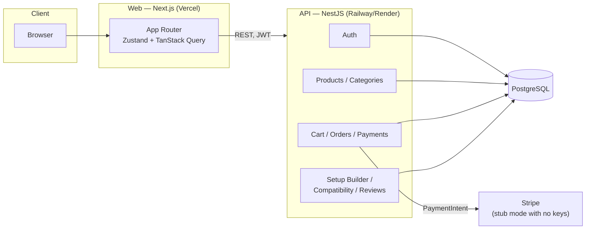

# OneSet

A premium tech & gaming setup store. Full-stack TypeScript monorepo: **Next.js** storefront, **NestJS** API, **PostgreSQL** via **Prisma**.

The idea behind the brand: you are not buying a mouse, you are buying the desk. Every surface in the app is built around a *set* — the hero is a real, addable setup; cross-sells pull from neighbouring categories instead of showing you four more mice.

All 12 sprints from the original plan are built. This is a portfolio project, not a production store, so the sections below are honest about what's verified by running code and tests versus what still needs a human with a browser and a hosting account.

---

## Quick start

Prerequisites: **Node 20+** and **Docker** (for Postgres).

```bash
# 1. Install everything (this also builds the shared @oneset/types package)
npm install

# 2. Environment files
cp .env.example apps/api/.env
cp apps/web/.env.example apps/web/.env.local

# 3. Start Postgres
npm run db:up

# 4. Create the schema and generate the Prisma client
npm run db:migrate

# 5. Seed 15 categories, ~110 products, 3 setups, 2 users
npm run db:seed

# 6. Run both apps
npm run dev
```

| What | Where |
| --- | --- |
| Storefront | http://localhost:3000 |
| API | http://localhost:4000/api |
| Swagger docs | http://localhost:4000/api/docs |
| Adminer (DB browser) | http://localhost:8081 — server `db`, user/pass/db all `oneset` |

**Seeded logins**

| Role | Email | Password |
| --- | --- | --- |
| Admin | `admin@oneset.tn` | `Admin123!` |
| Customer | `demo@oneset.tn` | `Password123` |

The login page pre-fills the customer account. Log in as `admin@oneset.tn` and open `/admin` (or the link on the account page) for the dashboard, product/category management, and the orders table.

**To leave a review:** reviews are purchase-gated, so add a product to cart, check out (the demo payment button works with no Stripe keys), and once the order confirms, that product's page shows a "Write a review" button.

**To see a compatibility warning:** the seed assigns CPU/RAM specs randomly (deterministically, but not by hand), so open `/compatibility`, try a couple of processor/memory combinations, and one that pairs a `DDR4` CPU with a `DDR5` kit (or the reverse) will flag red. The rule list at the bottom of that page shows exactly what's being checked.

**To try natural-language search:** the header search box (desktop) understands things like `"wireless gaming mouse under 300 TND"` — see **Natural-language search** below for how it works and more examples.

### Running the storefront without the backend

Leave `NEXT_PUBLIC_API_URL` empty (or just don't start the API) and the storefront runs on a bundled sample catalog — browse, filter, product pages, cart, wishlist all work. A banner says so, honestly. This is how Sprint 2 was built before the API existed, and it makes the site demoable from a single `npm run dev:web`.

### Other commands

```bash
npm run dev:web      # storefront only
npm run dev:api      # API only
npm run test         # cart/money unit tests (vitest)
npm run typecheck    # web + api
npm run build        # build everything
npm run db:studio    # Prisma Studio
npm run db:reset     # drop, re-migrate, re-seed
npm run db:down      # stop Postgres
```

> If the API complains that `@prisma/client` has no exported members, you skipped `npm run db:migrate` (or run `npx prisma generate -w @oneset/api`). Prisma generates its types from the schema.

---

## Design decisions

**Brand.** OneSet — one desk, one set, one delivery. The mark is four tiles with one locked in.

**Colour.** Light mode is the default: cool paper `#F6F6F4`, near-black ink, and a single cobalt accent `hsl(233 100% 57%)`. Dark mode is not an afterthought — it lifts the accent and drops the paper to `hsl(228 13% 6%)`. Every colour is a CSS variable in `globals.css` consumed by `tailwind.config.ts`, so both themes are one code path. No second accent, anywhere.

**Type.** Archivo for display (industrial grotesque, tracking tightened to −0.04em at hero size), Inter for everything else. Numbers are tabular everywhere money appears.

**Motif — "the set grid".** A hairline column grid behind the hero, tiles with 1px borders and a 12px radius, and pill-shaped buttons for contrast. Almost no shadows; structure comes from hairlines.

**Motion.** One orchestrated moment: the hero set module reveals its rows in sequence on load. Everything else is interaction feedback (quick-add, drawer, cart count). All of it respects `prefers-reduced-motion`.

**Money.** Stored and calculated as **integer millimes** (1 TND = 1000). Floats never touch a price. `packages/types/src/money.ts` and `cart.ts` own this, and the cart math is unit-tested — including the case where a coupon drops a basket back below the free-delivery threshold.

### Product imagery

Every product image is a deterministic seeded gradient (`gradient:<seed>` in the DB, rendered by `ProductMedia`). That was deliberate: fake photos of fake brands look worse than an intentional placeholder, and nothing breaks offline.

To use real images, put real URLs in `ProductImage.url`. `ProductMedia` renders anything that isn't a `gradient:` token as an image, and `next.config.mjs` already whitelists Cloudinary and Unsplash. Swap the `` for `next/image` at that point.

---

## Architecture

```
oneset/
├── apps/
│   ├── api/                 NestJS REST API
│   │   ├── prisma/          schema.prisma + deterministic seed
│   │   └── src/
│   │       ├── auth/        register, login, refresh, logout, reset, verify
│   │       ├── users/       profile, admin user list
│   │       ├── products/    filtering, facets, cross-sells, admin CRUD, setups
│   │       ├── categories/  public read + admin CRUD
│   │       ├── cart/        server cart, guest-cart merge on login
│   │       ├── wishlist/
│   │       └── common/      guards (JWT, roles), decorators, pagination DTO
│   └── web/                 Next.js App Router storefront
│       └── src/
│           ├── app/         routes
│           ├── components/  site/ home/ shop/ ui/
│           ├── store/       Zustand: auth, cart, wishlist, ui
│           ├── hooks/       TanStack Query wrappers
│           └── lib/         api client, sample data, URL-query helpers
├── packages/types/          shared models + money/cart math (+ tests)
├── docker-compose.yml       Postgres 16 + Adminer
└── .github/workflows/ci.yml typecheck → test → lint → build
```

**Frontend state split:** server data through TanStack Query (caching, loading, error states), client data through Zustand with `persist` (cart, wishlist, session, drawer). Filters live in the **URL**, not in state — every filtered view is a shareable link, and back/forward works.

**Cart behaviour:** guest carts are local and optimistic (the drawer opens on the same frame as the click). Log in and `POST /cart/merge` folds the guest cart into the account cart; a stale line can't break the login. Stock and the 10-per-line cap are enforced on both sides, by the same shared function.

**Auth:** access + refresh JWTs, refresh token stored hashed on the user row, single-flight refresh on the client so a burst of 401s triggers one refresh. Roles are enforced by a global guard with `@Public()` and `@Roles('ADMIN')` opt-outs.

> **Production note:** tokens currently live in `localStorage` so the API stays stateless and easy to poke at from Swagger. Before this went near real money, the refresh token should move to an httpOnly, SameSite cookie, with the access token kept in memory.

---

## API surface

| Method | Path | Access |
| --- | --- | --- |
| POST | `/api/auth/register`, `/login`, `/refresh` | public |
| POST | `/api/auth/forgot-password`, `/reset-password`, `/verify-email` | public |
| GET / POST | `/api/auth/me`, `/api/auth/logout` | authed |
| GET | `/api/products` | public — `q, category, brands, tags, minPrice, maxPrice, minRating, inStock, onSale, featured, sort, page, pageSize` |
| GET | `/api/products/facets` | public — brands/tags/price range for the current filters |
| GET | `/api/products/:slug`, `/:slug/related` | public |
| POST / PATCH / DELETE | `/api/products`, `/:id` | admin |
| GET | `/api/categories`, `/:slug` | public |
| POST / PATCH / DELETE | `/api/categories` | admin |
| GET | `/api/setups`, `/:slug` | public |
| POST | `/api/setup-builder` | public — proposes a setup for a budget and style, see below |
| GET | `/api/compatibility/rules` | public |
| POST | `/api/compatibility/check` | public — checks a set of product ids against active rules, see below |
| GET / POST / PATCH / DELETE | `/api/cart`, `/cart/items`, `/cart/merge` | authed |
| GET / POST / DELETE | `/api/wishlist` | authed |
| GET / POST / PATCH / DELETE | `/api/addresses` | authed — scoped to the logged-in user |
| POST | `/api/orders/checkout` | authed — turns the cart into an order and starts payment |
| POST | `/api/orders/:id/confirm-stub-payment` | authed — demo-mode payment confirmation (stub mode only) |
| GET | `/api/orders/mine`, `/:id` | authed |
| POST | `/api/orders/webhook` | public — Stripe webhook, active once `STRIPE_WEBHOOK_SECRET` is set |
| GET | `/api/products/:slug/reviews` | public |
| GET | `/api/products/:slug/reviews/mine` | authed — `{ canReview, alreadyReviewed }` |
| POST | `/api/products/:slug/reviews` | authed — requires a shipped order containing the product |
| GET | `/api/users` | admin |
| GET | `/api/admin/stats` | admin — revenue, orders, customers, low stock, top products |
| GET | `/api/orders` | admin — all orders, filterable by `status` and `search` |
| PATCH | `/api/orders/:id/status` | admin |

Password reset and email verification have no mail provider yet — the tokens are printed to the API console so the flow stays testable end to end.

---

## What's built, sprint by sprint

**Sprint 0 — Foundations.** Monorepo with npm workspaces, shared types package, Docker Postgres, Prettier/ESLint, GitHub Actions CI (typecheck → test → lint → build).

**Sprint 1 — Brand & shell.** Design tokens, light/dark with no flash, responsive header with search and cart count, footer, hero with the live set module, category grid, setups rail, featured rail.

**Sprint 2 — Catalog.** Shop and category pages, filter rail (category, price bands + custom range, brand, features, rating, availability), sort, active-filter chips, pagination, skeletons, empty and error states, mobile filter sheet. Product page with gallery, variant swatches, grouped specs, and "Perfect with this" cross-sells.

**Sprint 3 — Auth.** Register/login/refresh/logout/me, hashed passwords, roles guard, rate limiting, Swagger, login and register pages, protected account page.

**Sprint 4 — Catalog API.** Products and categories with filtering, facets, pagination and admin CRUD; ~110 seeded products across 15 categories with variants, specs and images; storefront wired to it with the sample-data fallback intact.

**Sprint 5 — Cart & wishlist.** Cart drawer with quantity steppers, free-delivery progress, and live totals; server cart with guest merge; wishlist with optimistic hearts; unit-tested cart math.

**Sprint 6 — Checkout & Stripe.** Address form, coupon codes, checkout page, order confirmation and history. Stripe integration is behind a feature flag: no `STRIPE_SECRET_KEY` runs a built-in demo payment form that exercises the full flow (order created, cart cleared, confirmation page); set the key and it switches to real Stripe Elements with no code changes. `Order`, `OrderItem`, `Payment` all live, no schema changes needed since they were modelled in Sprint 0.

**Sprint 7 — Reviews, coupons, addresses.** Reviews are purchase-gated — you can only review a product once an order containing it has shipped — and `Product.rating`/`reviewCount` recalculate live on submit. A real address book at `/account/addresses` (add, edit, delete, set default), and checkout now reuses a saved address instead of asking for one every time. Coupons were validated server-side since Sprint 6; this sprint didn't need to touch them.

**Sprint 8 — Admin dashboard.** `/admin` is role-gated (redirects non-admins) with a small nav: Dashboard, Products, Categories, Orders. The dashboard shows revenue (from paid orders only), total order count, customer count, a low-stock list, and top products by units sold. Product management is a real form — basics, price/stock, tags, and repeating rows for images, variants and specifications — backed by the admin CRUD endpoints from Sprint 4, not a mock. Categories get the same inline add/edit/delete pattern as the address book. Orders get a filterable table (status, search by reference or email) with an inline status dropdown that calls a new `PATCH /orders/:id/status` endpoint; admins can also open any customer's order via the existing `/orders/[id]` page, which now checks role before the ownership filter.

**Sprint 9 — Setup builder.** `/builder` takes a budget and a style, then proposes a complete six-piece setup with a real, documented allocation algorithm — not a random pick. Every style fills the same six slots (mouse, keyboard, headset, monitor, chair, desk); only the *budget weight* per slot changes between Performance, Balanced and Aesthetic, so a style never silently drops a category. Any slot can be swapped for another in-stock product from the same category, with totals, remaining budget and "N on sale" recalculating live. See **Setup builder algorithm** below for exactly how it picks.

**Sprint 10 — Compatibility engine & comparison.** `/compatibility` checks a CPU, RAM and GPU selection against every active row in the `CompatibilityRule` table — there is no per-product `if/else` anywhere in this code; the engine only knows how to apply five operators (`equals`, `startsWith`, `contains`, `gte`, `lte`) to whatever spec labels a rule names. The same check runs automatically (and quietly) inside the cart drawer the moment the cart mixes categories a rule cares about, so an incompatible pairing surfaces before checkout, not after. Product comparison lives at `/compare`: pick up to four products from any category (a small scale icon on every product card, mirroring the wishlist heart), and see every shared spec label side by side, grouped the same way the product page groups them. See **Compatibility rule engine** below for how a rule is evaluated.

**Sprint 11 — Smart search & UX polish.** The header search box parses free text like `"wireless gaming mouse under 300 TND"` into real filters — category, tags, a price ceiling — client-side, with no AI and no network round trip before the `/shop` redirect. It's a pure, unit-tested function; see **Natural-language search** below. Recently viewed products are tracked automatically (a small persisted store, same pattern as the wishlist) and surfaced on the product page and — if there's history — the homepage. A pass of small, deliberate motion went through the pieces the plan named by name: the theme toggle's icon swaps with a rotate-in instead of popping, Quick Add pops a checkmark on success, the wishlist heart and compare scale icon pop when toggled on, product photos zoom gently on hover, filter chips and tag pills get tactile press feedback, and category tiles lift slightly on hover. Everything respects `prefers-reduced-motion`, which the base styles already handled since Sprint 1.

**Sprint 12 — Final polish, testing, deployment.** The compatibility engine and setup-builder algorithm were pulled out of their NestJS services into pure functions in `@oneset/types` (`compatibility.ts`, `builder.ts`) specifically so they're unit-testable without a database — see **Testing** below for what's actually covered and how to run it, including a real e2e spec for the checkout flow the plan calls out by name. The rest of this sprint is an honesty exercise as much as a build: a code-level accessibility and empty-state pass (documented below), and a clear line between what's been verified by running code in this environment and what needs a human with a browser and a hosting account — a live Lighthouse score and a deployed URL are exactly that. See **What's verified vs. what you'll need to do** at the end of this README.

---

## Testing

```bash
npm run test          # unit tests — packages/types, runs in this environment, no DB needed
npm run test:e2e       # e2e — needs the full stack running locally, see below
npm run test:e2e:ui    # same, with Playwright's UI runner
```

**Unit tests** (`packages/types/src/*.test.ts`) cover the parts of the app that are pure logic — cart totals and the free-delivery threshold, the natural-language search parser (12 queries), the compatibility rule engine's five operators, and the setup-builder's budget-allocation algorithm (including a check that every style's weights sum to exactly 100). These run in any Node environment with no services and no network — that's the point of keeping them pure. As of this sprint: **45 tests, 4 files, all passing.**

**End-to-end** (`e2e/checkout.spec.ts`, Playwright) drives a real browser through the flow the plan calls out specifically: register a fresh account → add a product to cart → fill a delivery address → pay through the stub payment form → land on a real order confirmation page with a real order reference. To run it:

```bash
npm run db:up && npm run db:migrate && npm run db:seed   # if you haven't already
npx playwright install chromium                          # one-time browser download
npm run test:e2e
```

`playwright.config.ts` starts the dev stack for you (`reuseExistingServer: true`, so if `npm run dev` is already running it just uses that) and points at `http://localhost:3000`. Each run registers a timestamped throwaway account, so re-running the suite never collides with a previous run's data.

## Accessibility & empty states

This got a code-level pass, not a Lighthouse run — see the honesty note at the end of this README for why. What's actually true of the code today:

- Every interactive control is a native `<button>` or a `<Link>`, not a clickable `<div>`, so keyboard navigation and screen readers get sensible behaviour for free.
- `ProductMedia`'s `alt` prop is required by its TypeScript type, not just a convention — there's no code path that renders a product image without one.
- Collapsible sections (compatibility results, the setup builder's swap picker, the mobile filter sheet) carry `aria-expanded`; icon-only buttons (wishlist, compare, cart, theme toggle, quantity stepper) carry `aria-label`.
- Focus is visible everywhere (`:focus-visible` in `globals.css`), and every animation added in Sprint 11 respects `prefers-reduced-motion` through the same reduced-motion block that's been there since Sprint 1.
- Heading hierarchy on the pages checked (home, shop, product, checkout) goes h1 → h2 → h3 with nothing skipped.
- Every major screen has a loading, empty and error state — the catalog, the product page, the cart, checkout, wishlist, addresses, orders, and every admin table. The one gap this sprint found and fixed: the admin categories page had no explicit "no categories yet" message.

What this pass did **not** do: measure actual colour contrast ratios with a real renderer, or run an automated audit (axe, Lighthouse). The design tokens in `globals.css` were chosen with contrast in mind, but "chosen with contrast in mind" and "measured" are different claims — run `npm run build && npm run start` and point Lighthouse or the axe DevTools extension at it to get the real numbers.

---

## Natural-language search

The header search box runs every query through `parseNaturalQuery()` in `@oneset/types` before it ever reaches the API — a pure, dependency-free function, unit-tested with 12 real queries (`packages/types/src/search.test.ts`, run via `npm run test`). No AI, no extra request: matching is regex and a hand-written vocabulary of category aliases (`"mouse"` → `mice`, `"gpu"`/`"graphics card"` → `graphics-cards`, …) and tag aliases (`"low latency"` → `low-latency`, `"hot swap"` → `hot-swap`, …), plus price phrases (`"under 300"`, `"over 1000"`, `"between 700 and 1500"`) and a few sort/availability hints (`"cheapest"` → sort by price, `"in stock"`, `"on sale"`). Whatever's left after every known pattern is stripped becomes the free-text `q` — so a brand or model name that isn't in the vocabulary still reaches the normal search instead of being dropped. The parsed result feeds straight into the same `serializeQuery()` the shop's filter sidebar uses, so a natural-language search and a manually-filtered one produce identical, shareable URLs.

Try it: `"cheapest wireless headset"`, `"ddr5 memory under 500"`, `"standing desk with cable management"`, `"hall effect controller in stock"`.

---

## Compatibility rule engine

`POST /api/compatibility/check` (public) takes `{ productIds: string[] }` and checks every **active** `CompatibilityRule` row against every matching pair of selected products. A rule is a plain row:

```
name, sourceCategory, targetCategory, sourceSpec, targetSpec, operator, message, severity
```

For a rule to apply, the selection needs at least one product in `sourceCategory` and one in `targetCategory`. The engine reads `sourceSpec`/`targetSpec` off each product's `ProductSpecification` rows by label, then applies `operator`:

| Operator | Check |
| --- | --- |
| `equals` | values match, case-insensitive |
| `startsWith` | source value starts with target value |
| `contains` | source value contains target value |
| `gte` / `lte` | numeric comparison — the first number in each value is parsed out (`"850 W"` → `850`, `"6,000 MT/s"` → `6000`) |

If either product is missing the spec the rule asks for, that pair is skipped rather than guessed at. The two seeded rules:

- **RAM generation matches the CPU** — `processors.Memory support` `startsWith` `memory.Memory type` (a CPU listing `"DDR5-6000"` accepts a `"DDR5"` kit, not a `"DDR4"` one). Severity: error.
- **PSU headroom for the GPU** — `graphics-cards.Recommended PSU` `gte` `processors.TDP`. Severity: warning.

Add a rule by inserting a row — nothing in `compatibility.service.ts` changes. The cart drawer only bothers calling this endpoint when the cart actually contains one of the category pairs a rule cares about, so a cart of mice and keyboards never triggers a request.

---

## Setup builder algorithm

`POST /api/setup-builder` (public, no auth) takes `{ budgetMillimes, style }` and returns a proposal. The rule, in full:

1. **Fixed slots, variable weights.** Every style always proposes the same six roles — Pointer (mice), Board (keyboards), Sound (headsets), Display (monitors), Seat (chairs), Surface (desks). Only the *percentage of the budget* assigned to each slot changes by style. Weights sum to 100 for every style:

   | Slot | Performance | Balanced | Aesthetic |
   | --- | --- | --- | --- |
   | Pointer (mice) | 18% | 14% | 10% |
   | Board (keyboards) | 16% | 14% | 14% |
   | Sound (headsets) | 14% | 14% | 10% |
   | Display (monitors) | 32% | 22% | 24% |
   | Seat (chairs) | 12% | 20% | 22% |
   | Surface (desks) | 8% | 16% | 20% |

   Performance leans hardest on the monitor and the input devices — the pieces that affect reaction time. Aesthetic shifts weight toward the chair and desk — the pieces a camera actually sees. Balanced is the even middle.

2. **Picking within a slot.** For each slot, the budget share (`budget × weight%`) becomes a ceiling. Among in-stock products in that category, the algorithm picks the **most expensive one that still fits under the ceiling** — spending the slice fully rather than under-shooting it. If nothing in the category fits the ceiling (a tight budget against an expensive category, monitors being the usual culprit), it falls back to the **cheapest in-stock product in that category**, so a slot is never left empty — the trade-off is visible instead as a negative "remaining budget."

3. **Nothing random, nothing hidden.** No RNG anywhere in the algorithm — the same budget and style always produce the same proposal against the same catalog. The weight table above is the entire ruleset.

4. **Swapping.** Each slot can be swapped for any other in-stock product in the same category (fetched from the normal `/api/products?category=` endpoint); totals, remaining budget and the on-sale count recompute client-side from whatever is currently in each slot.

---

## Architecture



Everything under **API** is one NestJS process with one Postgres database — there's no separate service per box above, that's just how the modules split logically (`apps/api/src/*`). The web app never talks to Postgres or Stripe directly; every request goes through the API.

## Deployment

- **Web** → Vercel. Set `NEXT_PUBLIC_API_URL` to the deployed API.
- **API** → Railway, Render or Fly. Set `DATABASE_URL`, both JWT secrets, and `WEB_ORIGIN` to the Vercel URL. Run `npx prisma migrate deploy` on release, not `migrate dev`.
- **Database** → the managed Postgres from whichever host runs the API (Neon and Supabase both work).

Rotate `JWT_ACCESS_SECRET` and `JWT_REFRESH_SECRET` before anything public — the committed values are development defaults.

**Step by step (Railway for the API + Postgres, Vercel for the web app):**

1. Push this repo to GitHub.
2. **Railway:** New Project → Deploy from GitHub → pick the repo → set the service's root directory to `apps/api`. Add a Postgres plugin to the same project (Railway wires `DATABASE_URL` automatically). Set the remaining env vars from `apps/api/.env.example` (`JWT_ACCESS_SECRET`, `JWT_REFRESH_SECRET` — generate real random values — `WEB_ORIGIN` — fill in after step 3). Set the build command to `npm install && npm run build -w @oneset/types && npm run build -w @oneset/api` and the start command to `npx prisma migrate deploy && node apps/api/dist/main.js`. Copy the resulting public URL.
3. **Vercel:** New Project → import the same repo → set the root directory to `apps/web`. Add `NEXT_PUBLIC_API_URL` = the Railway URL + `/api`. Deploy. Copy the resulting URL.
4. Back in Railway, set `WEB_ORIGIN` to the Vercel URL from step 3 and redeploy the API (CORS needs it).
5. From your machine, point `DATABASE_URL` at the Railway Postgres instance (Railway shows a connection string) and run `npm run db:seed` once so the deployed site isn't empty.
6. Add the live URL to the top of this README.

This takes about 15–20 minutes and produces the "live deployed demo" and "live URL in README" the plan asks for — I can't complete it from this sandbox since it needs a GitHub push and real hosting accounts, but every step above is concrete enough to follow directly.

---

## What's verified vs. what you'll need to do

Everything in this README that describes *behaviour* — the cart math, the search parser, the compatibility engine, the builder's allocation, every `npm run build` and `npm run test` result quoted above — was actually run against this code, not asserted from memory. Three things in the original plan's Sprint 12 acceptance criteria genuinely can't be produced from a sandboxed environment with no browser and no hosting access, so here's exactly what's left and how to close each one:

- **A live deployed demo with a URL in the README.** Follow **Deployment** above, then replace this bullet with your URL.
- **A Lighthouse score ≥ 90 on Performance/Accessibility/SEO.** Run a production build, not dev mode (dev mode always scores worse):
  ```bash
  npm run build -w @oneset/web && npm run start -w @oneset/web
  npx lighthouse http://localhost:3000 --view
  ```
  Repeat for `/shop` and a product page. If Performance comes in under 90, the usual first fix on a catalog site is image weight — this project currently renders product art as inline SVG-free CSS gradients specifically to avoid that problem (see **Product imagery** above), so a low score more likely points at font loading or third-party script weight than at product photos.
- **Screenshots in the README.** Run the app locally (`npm run dev`) and capture: the homepage hero, `/shop` with filters open, a product page, the cart drawer, `/builder` with a result, and `/admin`. Drop them in a `docs/screenshots/` folder and reference them here with standard Markdown image syntax.

---

This is a portfolio project. The brands, products and prices are invented.
