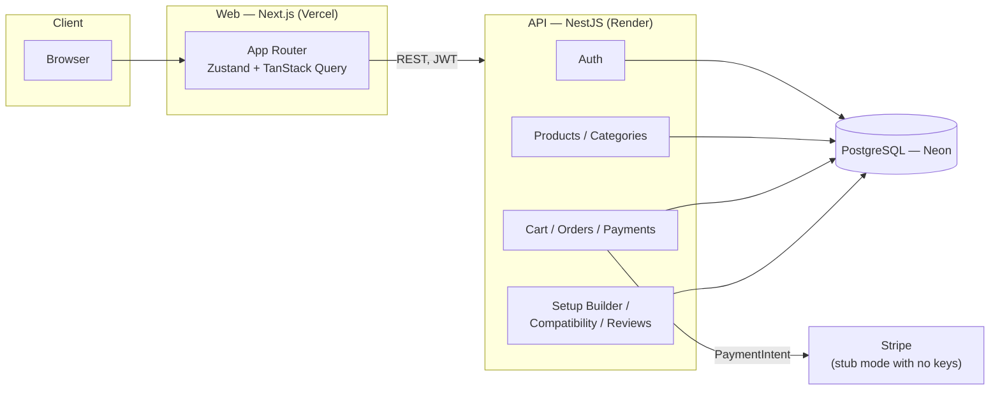

# OneSet

A full-stack e-commerce demo for a premium gaming/desk-setup store. Built to show a complete, working product — not a UI mockup: real auth, a real cart, real Stripe-ready checkout, an admin dashboard, and a few less-common features (a rule-based setup builder, a compatibility checker, natural-language search).

**Customer login:** `demo@oneset.tn` / `Password123`

---

## Stack

- **Web:** Next.js 14 (App Router), TypeScript, Tailwind, Zustand, TanStack Query
- **API:** NestJS, Prisma, PostgreSQL, JWT auth
- **Payments:** Stripe Elements — falls back to a working demo payment flow when no keys are set, so checkout is fully testable without a Stripe account
- **Tests:** Vitest (unit) + Playwright (e2e)
- **Monorepo:** npm workspaces, shared types/logic in `packages/types`

## Features

- Catalog with filtering, sorting, and a natural-language search box (`"wireless mouse under 300 TND"` → real filters, no AI, just a parser)
- Cart, wishlist, and a checkout flow that produces real orders
- Reviews gated to people who actually bought the product
- Admin dashboard: revenue/orders overview, product & category management, order status control
- **Setup builder** (`/builder`): give it a budget and a style, get a proposed setup from a documented, rule-based allocation algorithm — not random
- **Compatibility checker** (`/compatibility`): flags incompatible part pairings (e.g. DDR4 RAM on a DDR5-only CPU) using rules stored in the database, not hardcoded logic
- Product comparison, up to 4 items side by side

## Quick start

Needs Node 20+ and Docker.

```bash
npm install
cp .env.example apps/api/.env
cp apps/web/.env.example apps/web/.env.local
npm run db:up
npm run db:migrate
npm run db:seed
npm run dev
```

Web on `:3000`, API on `:4000/api`, Swagger docs at `:4000/api/docs`.

Leaving `NEXT_PUBLIC_API_URL` empty runs the storefront on bundled sample data — no backend needed to browse.

## Testing

```bash
npm run test       # unit tests — cart math, search parser, compatibility engine, setup builder
npm run test:e2e   # e2e — full register → cart → checkout → order flow (Playwright)
```

## Architecture



One NestJS process, one Postgres database — the boxes above are logical modules (`apps/api/src/*`), not separate services. The web app never talks to Postgres or Stripe directly, everything goes through the API.

## Notes

- **Money** is stored as integer millimes (1 TND = 1000) everywhere, never floats — see `packages/types/src/money.ts`.
- **Product images** are currently deterministic placeholder gradients rather than real photography (the brands are invented, so there's no real product photography to use) — real images are the next thing to swap in.
- Tokens live in `localStorage` for simplicity; a production version of this would move the refresh token to an httpOnly cookie.

This is a portfolio project. The brands, products and prices are invented.