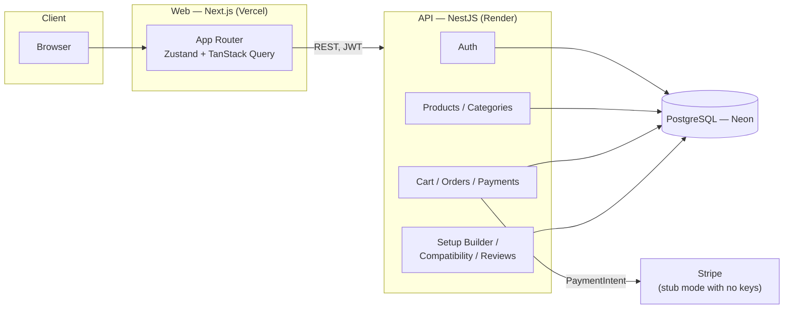

# OneSet — Full-Stack E-Commerce Platform

OneSet is a complete e-commerce platform for a gaming and desk-setup store, built to demonstrate a full production-style build rather than a UI mockup: real authentication, a real cart, a real Stripe-integrated checkout, an admin dashboard, and a few features that go beyond a typical store template — a rule-based setup builder, a data-driven compatibility checker, and natural-language search.

**Live demo:** [[add your URL](https://oneset-three.vercel.app/)]

**Customer login:** `demo@oneset.tn` / `Password123`

---

## What was built

**Storefront** — Product catalog with filtering, sorting, and search, including a natural-language parser that turns a query like `"wireless mouse under 300 TND"` into real category/price/tag filters without calling an AI model. Product pages with variants, specs, and reviews. A cart that persists for guests and syncs to an account on login.

**Accounts & checkout** — JWT-based auth (access + refresh tokens), saved addresses, and a checkout flow that creates real orders. Stripe Elements is wired in behind a feature flag: with no API key set, a built-in demo payment mode lets the whole flow — including order confirmation — be tested without a Stripe account; adding a key switches to real Stripe payments with no code changes.

**Admin dashboard** — Revenue and order metrics, low-stock alerts, and full CRUD for products, categories and order status, gated to admin accounts.

**Setup builder** — Give it a budget and a style (Performance / Balanced / Aesthetic) and it proposes a complete setup using a documented, rule-based budget-allocation algorithm — each style spends the same six product categories, just in different proportions, rather than picking anything at random.

**Compatibility checker** — Flags incompatible part pairings (e.g. DDR4 memory on a DDR5-only CPU) by evaluating rules stored in the database against product specs, so a new rule doesn't require new code.

**Reviews & comparison** — Reviews are gated to people who actually bought the product being reviewed. Products can be compared side by side, up to four at once.

---

## Tech stack

| Layer | Technology | Why |
|---|---|---|
| Frontend | Next.js 14 (App Router), TypeScript, Tailwind CSS | Server and client rendering where each fits, typed end to end |
| State | Zustand, TanStack Query | Client state (cart, auth, UI) kept separate from server state (catalog, orders) |
| Backend | NestJS, TypeScript | Modular REST API — auth, products, orders and admin as separate modules |
| Database | PostgreSQL, Prisma ORM | Typed queries and migrations |
| Payments | Stripe Elements | Real payment intents, with a working fallback for demoing without live keys |
| Testing | Vitest, Playwright | Unit tests on the core business logic (cart totals, search parsing, compatibility rules, the builder's allocation algorithm), plus an end-to-end test on the full checkout flow |
| Infra | npm workspaces monorepo, Docker (local Postgres) | Shared types and logic between frontend and backend in one package |

## Architecture



One NestJS process backs the whole API — the boxes above are logical modules (`apps/api/src/*`), not separate deployed services. The web app never talks to Postgres or Stripe directly; every request goes through the API, which is what enforces auth, validates input, and owns the business rules.

**Money** is stored as integer millimes (1 TND = 1000) everywhere, never as a float, to avoid rounding bugs in cart totals and discounts.

---

## Running it locally

Needs Node 20+ and Docker.

```bash
npm install
cp .env.example apps/api/.env
cp apps/web/.env.example apps/web/.env.local
npm run db:up
npm run db:migrate
npm run db:seed
npm run dev
```

Web runs on `:3000`, API on `:4000/api`, Swagger docs at `:4000/api/docs`.

```bash
npm run test       # unit tests
npm run test:e2e   # end-to-end checkout flow (Playwright)
```

---

## License

See [LICENSE](./LICENSE). All rights reserved — this is a portfolio project, and the brand, products and prices are invented.